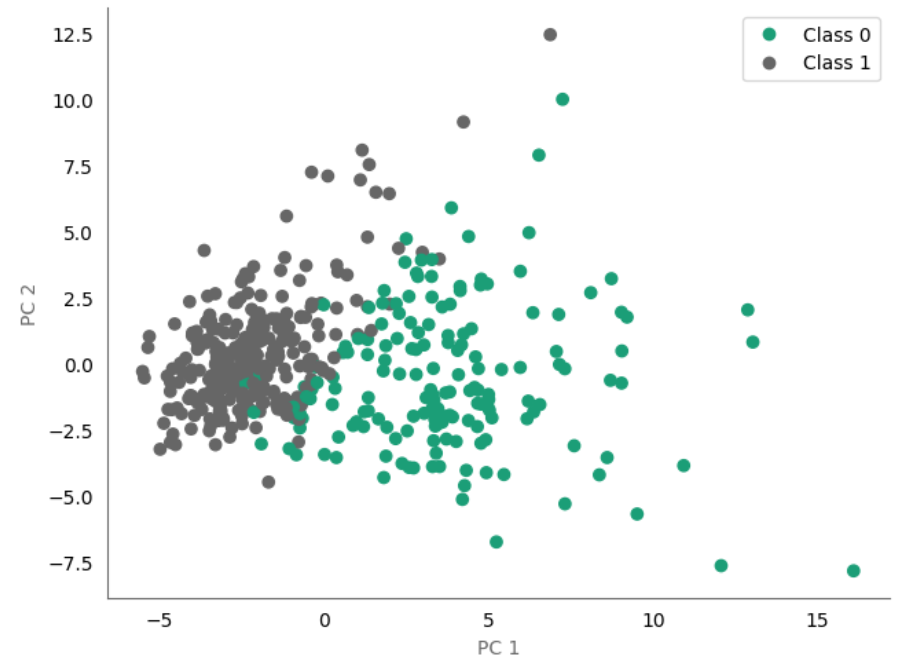
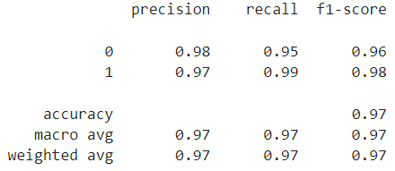
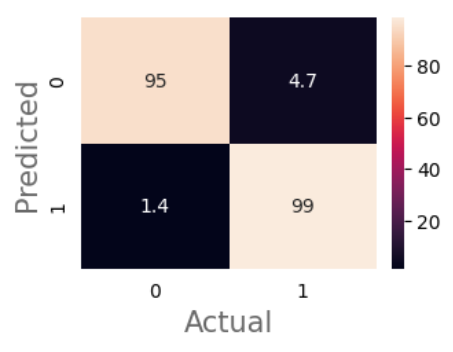
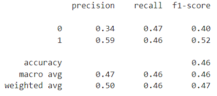
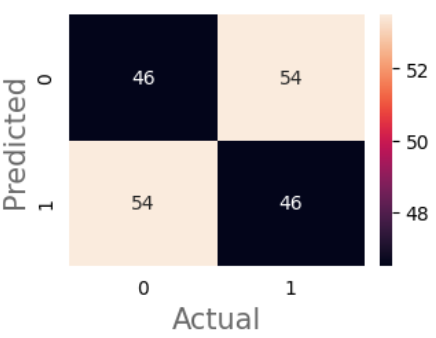

# Predicting breast cancer

* Anticipating and proactively addressing health challenges is a critical aspect of modern healthcare as early detection often leads to improved patient outcomes. For instance, if healthcare providers can diagnose cancer earlier, treatment strategies can be implemented before the progression of the disease.

* The goal of this project was, therefore, to predict breast cancer diagnosis using cell nuclei characteristics extracted from images of breast tissue. The [Breast Cancer Wisconsin (Diagnostic) dataset](https://archive.ics.uci.edu/dataset/17/breast+cancer+wisconsin+diagnostic) was utilised.

## File structure

<pre>
|- predict-breast-cancer/
   |- custom_funcs.py
|- data/
   |- raw/
   |- cleaned/    
|- notebooks/
   |- data_exploration.ipynb
   |- predictive-modelling.ipynb
   |- figures/
|- .gitignore
|- LICENSE
|- README.md
</pre>

## Scope

**a) Context**

* [Breast Cancer Wisconsin (Diagnostic) Dataset](https://archive.ics.uci.edu/dataset/17/breast+cancer+wisconsin+diagnostic) is a real world multivariate dataset containing $30$ continuous features and a binary diagnosis target.

* Features are computed from a digitized image of a fine needle aspirate (FNA) of a breast mass. They describe characteristics of the cell nuclei present in the image.

**b) Model**

* The categorical target is binary. Consequently, the problem will be approached as a binary classification.

* No baseline model is available for benchmarking. The model will therefore be compared to a no-skill classifier.

**c) Technical requirements**

* In reality, predictions by the model would likely be generated for a batch of inputs on a recurring schedule (e.g. weekly) rather than processing each input data point individually in real time. Predictions would then nr stored in a database and made available to end users.

* At this stage, the model will not be deployed. However, batch inference will be assumed. This has several advantages:

    - there aren't low latency requirements (which place constraints on infrastructure and model complexity)

    - scalable compute resources can be used (e.g. batch inference using parallelisation via Spark)

    - predictions generated during batch inference can be analyzed and post processed before being seen by stakeholders

**d) Data requirements**

* No further data collection is required.

* No personal data is involved. Consequently there are no apparent legal/ethical constraints (e.g. GDPR).

## Model performance metrics

* The performance metrics should align closely with the specific business problem at hand.

* While a single metric simplifies ranking model performance, the dataset's slight imbalance makes overall accuracy unsuitable. Instead the goal was to maximise recall with a nominal constraint of 50% for precision.

* Recall reflects the model's ability to identify all cancers (i.e. minimise false negatives). Whilst precision reflects the proportion of diagnoses which are correct (i.e. inversely proportional to the number of false positives). 

* It is assumed the cost of a false negative prediction (i.e. incorrectly classifying a cancer as okay) outweighs the cost of a false positive prediction. The primary and secondary metrics are therefore recall and precision respectively.   

* F1-score was used during hyperparameter optimisation. 

## Model selection

* Due to substantial multicollinearity, Principal Component Analysis was conducted. The transformed data was used during model training.

* The decision boundary appeared approximately linear when visualising the two principal components with the largest eigenvalues. Consequently a logistic regression model (with L2 regularisation) was optimised.

    

* The final model utilised $15$ principal components and a regularisation strength of $1$. The below classification report and confusion matrix shows the test set performance after retraining with the entire training set.

    

    

*Where class $1$ corresponds to cancer.*

* The performance of a no-skill classifier on the test data is shown below.

    

    

## Conclusion

* Overall predictive performance was high. The goal was to maximise recall whilst ensuring a precision of at least $0.5$. This target was exceeded. Furthermore the model performs better than a random classifier across all metrics.